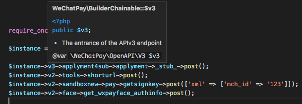
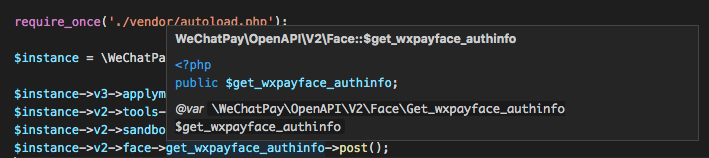
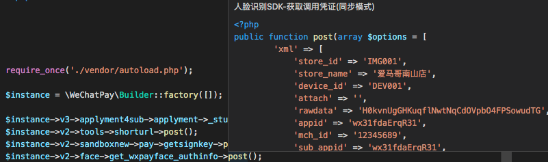

# 微信支付OpenAPI接口文档

为 `wechatpay/wechatpay` 增加IDE提示的接口描述包，整理自[官方文档中心](https://pay.weixin.qq.com/wiki/doc/apiv3/index.shtml)

## PHP

推荐使用 `composer v2` 安装

`composer require --dev iwechatpay/openapi`

## IDE提示

[工作原理及介绍见这里](https://developers.weixin.qq.com/community/develop/article/doc/000a0ce867842092f8cc65e5356013)

## 特殊URI语法规则

| 源URI | 模版变量 | 值 |
| --- | --- | --- |
| `secapi/mch/addInstitutionsub` | `{addinstitutionsub}` [^1] | `addInstitutionsub` |
| `secapi/mch/modifyInstitutionsub` | `{modifyinstitutionsub}` [^1] | `modifyInstitutionsub` |
| `secapi/mch/queryInstitutionsub` | `{queryinstitutionsub}` [^1] | `queryInstitutionsub` |
| `v3/applyment4sub/applyment/` | `{empty}` [^2] | |
| `v3/ecommerce/applyments/` | `{empty}` [^2] | |
| `v3/ecommerce/subsidies/return` | `{return}` [^3] | `return` |
| `v3/marketing/busifavor/coupons/return` | `{return}` [^3] | `return` |
| `v3/marketing/busifavor/coupons/use` | `{use}` [^4] | `use` |

[^1]: 源URI上含有`I`大写字符，需要用模版变量构造
[^2]: 源URI末尾以`/`结尾，需要值为用空的模版变量构造，`{empty}`为`RFC6570`Level3保留语法
[^3]: 源URI末尾segment单词是`return`，其为PHP语法关键字，需要用模版变量构造
[^4]: 源URI末尾segment单词是`use`，其为PHP语法关键字，需要用模版变量构造

## License

[MIT](LICENSE)
